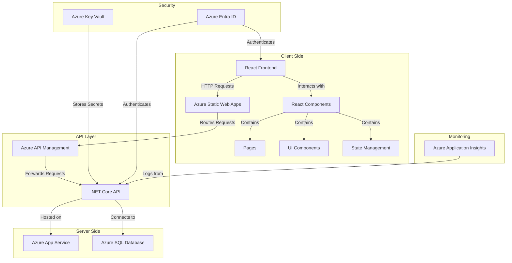

# StudioWorld


## Website

### Architecture Overview




### Project Structure

```markdown
StudioWorld/
├── WebSite/
│   ├── studio-world-client/      # React Frontend
│   │   ├── public/
│   │   │   └── vite.svg          # Static assets
│   │   ├── src/
│   │   │   ├── components/       # Reusable UI components
│   │   │   │   ├── Footer.jsx    # Footer component
│   │   │   │   ├── Layout.jsx    # Main layout component
│   │   │   │   ├── Navigation.jsx # Navigation bar
│   │   │   │   └── ServiceCard.jsx # Service card component
│   │   │   ├── pages/            # Page components
│   │   │   │   ├── About.jsx     # About page
│   │   │   │   ├── Contact.jsx   # Contact page
│   │   │   │   ├── Home.jsx      # Home page
│   │   │   │   ├── Schedule.jsx  # Scheduling page
│   │   │   │   ├── Services.jsx  # Services page
│   │   │   │   └── Training.jsx  # Training programs page
│   │   │   ├── hooks/            # Custom hooks
│   │   │   │   ├── useApi.js     # API integration hook
│   │   │   │   └── useForm.js    # Form management hook
│   │   │   ├── context/          # Context API
│   │   │   │   └── AppContext.js # Global state management
│   │   │   ├── styles/           # CSS/SCSS styles
│   │   │   ├── App.tsx           # Main application component
│   │   │   ├── index.css         # Global CSS
│   │   │   └── main.tsx          # Entry point
│   │   └── package.json          # Frontend dependencies
│   │
│   └── StudioWorld.API/          # .NET Core Backend
│       ├── Controllers/          # API controllers
│       │   ├── BookingsController.cs    # Bookings API
│       │   ├── ServicesController.cs    # Services API
│       │   └── TrainingProgramsController.cs # Training API
│       ├── Models/               # Data models
│       │   ├── Booking.cs        # Booking model
│       │   ├── Service.cs        # Service model
│       │   └── TrainingProgram.cs # Training program model
│       ├── Data/                 # Data access layer
│       │   └── DbContext.cs      # Database context
│       ├── Program.cs            # Application entry point
│       └── StudioWorld.API.csproj # Backend project file
│
└── infra/                        # Infrastructure as Code (IaC)
    ├── main.tf                   # Terraform configuration
    └── variables.tf              # Terraform variables
```


## Implementation Plan

### Backend

- **Framework**: .NET Core scaffolding.

- **Database**: Single SQL Database.

- **ORM**: Entity Framework Core.

- **API**: RESTful Controllers for Services, Bookings, and TrainingPrograms.

### Frontend

- **Framework**: React with TypeScript.

- **Styling**: TailwindCSS.

- **Layout**:

  - **Desktop**: A long panel on the left (1/3 of the screen) and two horizontal sections on the right (2/3 of the screen).

  - **Mobile**: Sections stack vertically.

- **State Management**: Context API.

- **Routing**: React Router.

- **Error Handling**: ErrorBoundary.

- **Custom Hooks**: API integration (useApi) and form management (useForm).

### Infrastructure

- **Region**: eastus2.

- **Assumptions**:

  - Infrastructure (including Application Insights) is pre-existing.

  - Secrets will be provided via GitHub Actions secrets.

### Testing

- **Performance Testing**: JMeter.

- **End-to-End Testing**: Playwright.

### CI/CD

- **Tool**: GitHub Actions.

- **Trigger**: On merges to the `main` branch.

- **Deployment**:

  - Build and deploy to an existing Linux App Service plan.

  - Use the publishing profile stored in GitHub Actions secrets.

## Next Steps

1. Scaffold the backend and frontend.

2. Implement database schema and secure APIs.

3. Develop the React frontend with responsive layout and error handling.

4. Define and validate the CI/CD pipeline.

5. Test the user flow for seamless navigation.

6. Set up monitoring with Application Insights.
