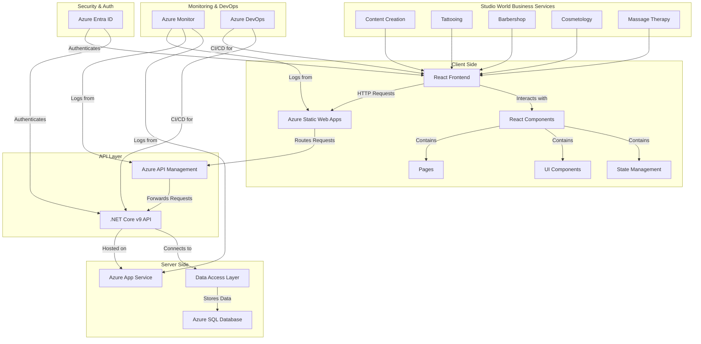

# StudioWorld

Chris Scott's project for Studio World

## Identities

### Azure Entra

Display name:  Chris Scott studioworld.org

Username:  <Chris.Scott@studioworld.org>

Password:  H%410805711904ag

## Website

### Architecture Overview



### Key Components

### Frontend (React)

- **Pages**: Home, Services, About, Schedule, Training, Contact
- **Components**: Navigation, Footer, ServiceCard, Layout
- **State Management**: React Hooks for local state
- **Routing**: React Router for page navigation
- **API Integration**: Fetch API for connecting to backend services

### Backend (.NET Core v9)

- **APIs**: Services, Bookings, TrainingPrograms
- **Controllers**: ServicesController, BookingsController, TrainingProgramsController
- **Models**: Service, Booking, TrainingProgram
- **Cross-Origin Resource Sharing (CORS)**: Configured for API access from frontend

### Current Implementation Status (MVP)

- **Frontend**:
  - Responsive layout with navigation and footer
  - All main pages implemented (Home, Services, About, Schedule, Training, Contact)
  - Services page fetches data from API
  - Training page fetches training programs and schedule from API
  - Booking forms for services and training programs

- **Backend**:
  - RESTful API endpoints for services, bookings, and training programs
  - In-memory data store for MVP phase
  - CORS configuration to allow frontend access

### Future Cloud Services (Azure)

- **Hosting**: Azure Static Web Apps (Frontend), Azure App Service (Backend)
- **API Management**: Request routing, security, throttling
- **Database**: Azure SQL Database
- **Identity**: Azure Entra ID
- **Monitoring**: Azure Application Insights

### Component Details

#### Client-Side Components

- **React Frontend**: The user interface built with React, providing an interactive experience
- **React Components**: Modular UI pieces that make up the interface
  - Pages: Home, Services, About, Schedule, Training, Contact
  - UI Components: Navigation, Service Cards, Booking Forms
  - State Management: Uses React Hooks to manage application state

#### API Layer

- **Azure Static Web Apps**: Hosts the React frontend and provides global CDN distribution
- **Azure API Management**: Routes API requests, provides security, and manages API traffic
  - Handles authentication/authorization
  - Provides rate limiting & throttling
  - Offers analytics on API usage

#### Server-Side Components

- **.NET Core v9 API**: The backend server built with .NET Core v9
  - Provides business logic implementation
  - Handles data processing and validation
  - Manages authentication with Azure Entra ID

#### Data Flow

1. Users interact with the React frontend
2. The frontend sends HTTP requests to Azure Static Web Apps
3. Static Web Apps routes requests to Azure API Management
4. API Management forwards requests to the .NET Core API
5. The API processes requests through the business logic layer
6. Data is retrieved or stored via the Data Access Layer
7. Azure SQL Database provides persistent data storage

## Implementation Status

### Current MVP Implementation

The current implementation is a Minimum Viable Product (MVP) with the following features:

- **Frontend**:
  - Complete page structure with React components
  - Navigation between pages using React Router
  - Services page that fetches and displays available services
  - Training page that shows available programs and schedule
  - Contact and booking forms (UI only for now)

- **Backend**:
  - RESTful API with controllers for Services, Bookings, and Training Programs
  - In-memory data store for development purposes
  - CORS configuration to allow frontend access

### Next Steps

1. **Data Persistence**:
   - Implement Entity Framework Core for data access
   - Set up Azure SQL Database

2. **Authentication**:
   - Integrate Azure Entra ID for authentication
   - Implement user roles and permissions

3. **Deployment**:
   - Deploy frontend to Azure Static Web Apps
   - Deploy backend to Azure App Service
   - Configure Azure API Management

4. **Additional Features**:
   - User accounts and profile management
   - Online payments for services and training programs
   - Admin dashboard for managing bookings and content

### Project Structure

```markdown
StudioWorld/
├── WebSite/
│   ├── studio-world-client/      # React Frontend
│   │   ├── public/
│   │   │   └── vite.svg          # Static assets
│   │   ├── src/
│   │   │   ├── components/       # Reusable UI components
│   │   │   │   ├── Footer.jsx    # Footer component
│   │   │   │   ├── Layout.jsx    # Main layout component
│   │   │   │   ├── Navigation.jsx # Navigation bar
│   │   │   │   └── ServiceCard.jsx # Service card component
│   │   │   ├── pages/            # Page components
│   │   │   │   ├── About.jsx     # About page
│   │   │   │   ├── Contact.jsx   # Contact page
│   │   │   │   ├── Home.jsx      # Home page
│   │   │   │   ├── Schedule.jsx  # Scheduling page
│   │   │   │   ├── Services.jsx  # Services page
│   │   │   │   └── Training.jsx  # Training programs page
│   │   │   ├── services/         # API services
│   │   │   │   └── api.js        # API client functions
│   │   │   ├── styles/           # CSS/SCSS styles
│   │   │   ├── utils/            # Utility functions
│   │   │   ├── App.css           # Main CSS file
│   │   │   ├── App.jsx           # Main application component
│   │   │   ├── index.css         # Global CSS
│   │   │   └── main.jsx          # Entry point
│   │   └── package.json          # Frontend dependencies
│   │
│   └── StudioWorld.API/          # .NET Core v9 Backend
│       ├── Controllers/          # API controllers
│       │   ├── BookingsController.cs    # Bookings API
│       │   ├── ServicesController.cs    # Services API
│       │   └── TrainingProgramsController.cs # Training API
│       ├── Models/               # Data models
│       │   ├── Booking.cs        # Booking model
│       │   ├── Service.cs        # Service model
│       │   └── TrainingProgram.cs # Training program model
│       ├── Data/                 # Data access (placeholder for future DB integration)
│       ├── Program.cs            # Application entry point
│       └── StudioWorld.API.csproj # Backend project file
│
└── Documentation/               # Project documentation (placeholder)
```
