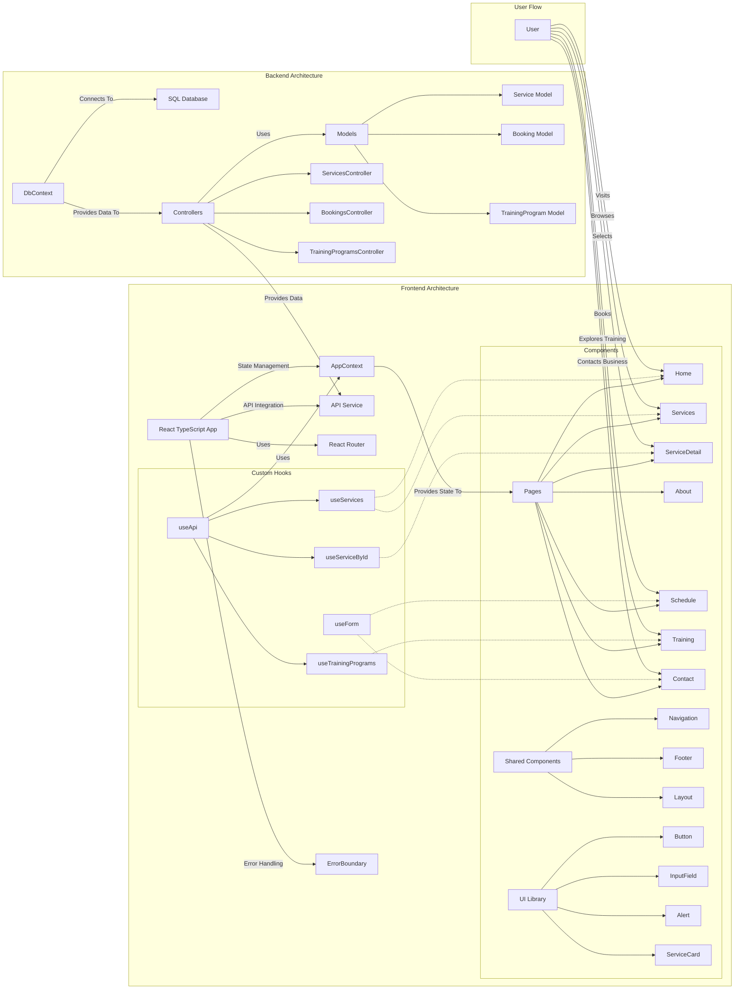

# StudioWorld MVP Architecture Diagram

This diagram illustrates the architecture and components of the StudioWorld MVP project. The project follows a modern .NET Core backend and React + TypeScript frontend approach, with a left-to-right data flow.

## Backend Architecture

### Data Layer

- **SQL Database**: Persistent storage for application data
- **DbContext**: Entity Framework Core context for database access

### Business Logic

- **Models**: Data models that represent business entities
  - **Service Model**: Represents artistic services offered
  - **Booking Model**: Represents customer appointments
  - **TrainingProgram Model**: Represents training courses offered

### API Layer

- **Controllers**: API endpoints that handle HTTP requests
  - **ServicesController**: Manages service-related operations
  - **BookingsController**: Manages booking-related operations
  - **TrainingProgramsController**: Manages training program operations

## Frontend Architecture

### Core

- **API Service**: Centralized service for making HTTP requests to the backend
- **React TypeScript App**: Main application built with React and TypeScript
- **React Router**: Handles routing between different pages
- **AppContext**: Global state management using Context API
- **ErrorBoundary**: Catches and handles React component errors

### Custom Hooks

- **useApi**: Hooks for data fetching
  - **useServices**: Fetches all services
  - **useTrainingPrograms**: Fetches training programs
  - **useServiceById**: Fetches a specific service by ID
- **useForm**: Hook for form state management and validation

### Components

- **Pages**: Main page components
  - **Home**: Landing page
  - **Services**: Services listing page
  - **ServiceDetail**: Detailed view of a service
  - **About**: Company information page
  - **Schedule**: Booking/scheduling page
  - **Training**: Training programs page
  - **Contact**: Contact form and information
- **Shared Components**: Reusable layout components
  - **Navigation**: Site navigation menu
  - **Footer**: Site footer
  - **Layout**: Common layout wrapper
- **UI Library**: Core UI components
  - **Button**: Reusable button component
  - **InputField**: Form input component
  - **Alert**: Notification component
  - **ServiceCard**: Service preview component

## User Flow

The diagram illustrates the user journey through the StudioWorld application:

- **Visits Home**: Users start at the landing page to get an overview of services
- **Browses Services**: Users explore all available artistic services
- **Selects a Service**: Users view detailed information about specific services
- **Books an Appointment**: Users schedule appointments for services
- **Explores Training**: Users view available training programs and courses
- **Contacts Business**: Users reach out with questions or inquiries

This flow provides a seamless experience from discovery to booking, ensuring users can easily navigate the platform and engage with the business offerings.
